# Present Please!

An AI-assisted classroom attendance system that keeps timetables, scheduled
classes, attendance capture and attendance records in a single workflow.
Teachers take attendance by photographing the room or recording a roll call;
the AI produces a draft roster, and the teacher confirms it before anything
is saved.

`React` `TypeScript` `FastAPI` `Python` `Supabase` `PostgreSQL` `Computer Vision` `Voice Recognition`

## Screenshots


### Teacher

| | |
| --- | --- |
| 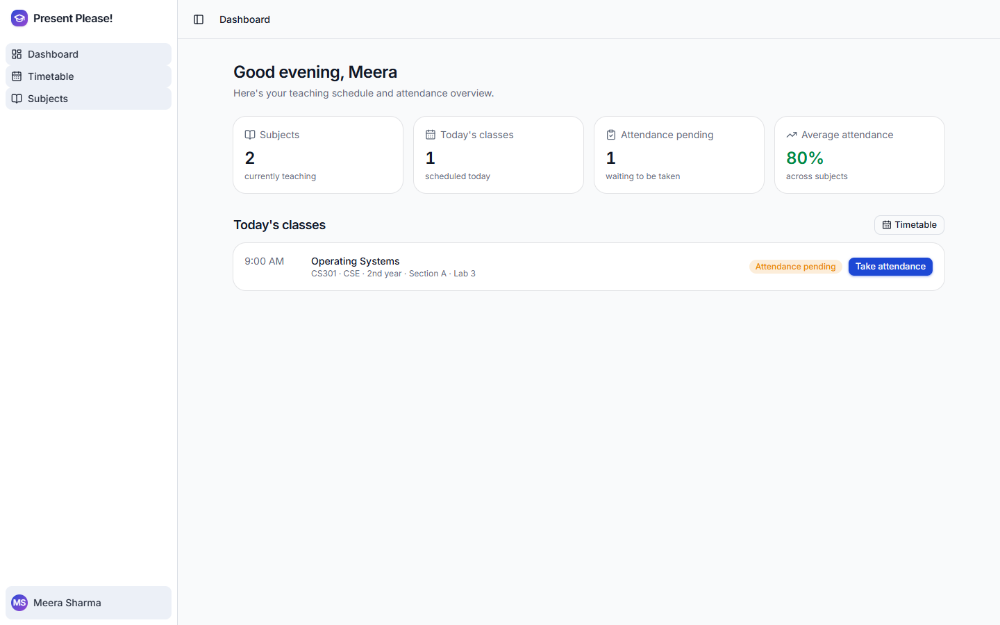 |  |
| Dashboard: today's classes, outstanding attendance, and the average across subjects. | Weekly timetable, with branch, year, room and a derived status on every class. |
| 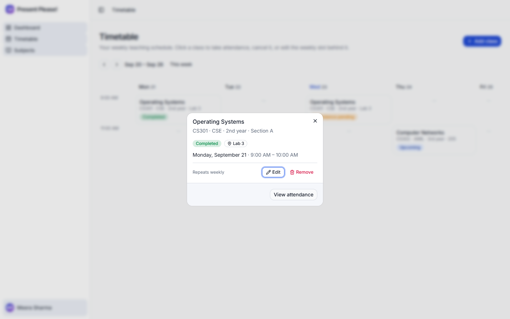 | 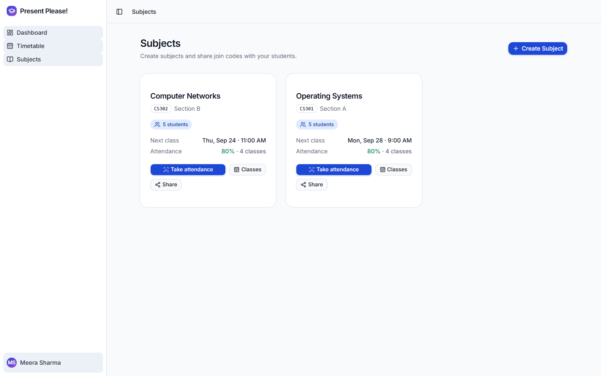 |
| Opening a class: take attendance, cancel it, or edit the weekly slot behind it. | Subjects, each with its join code, enrolled count and attendance rate. |
| 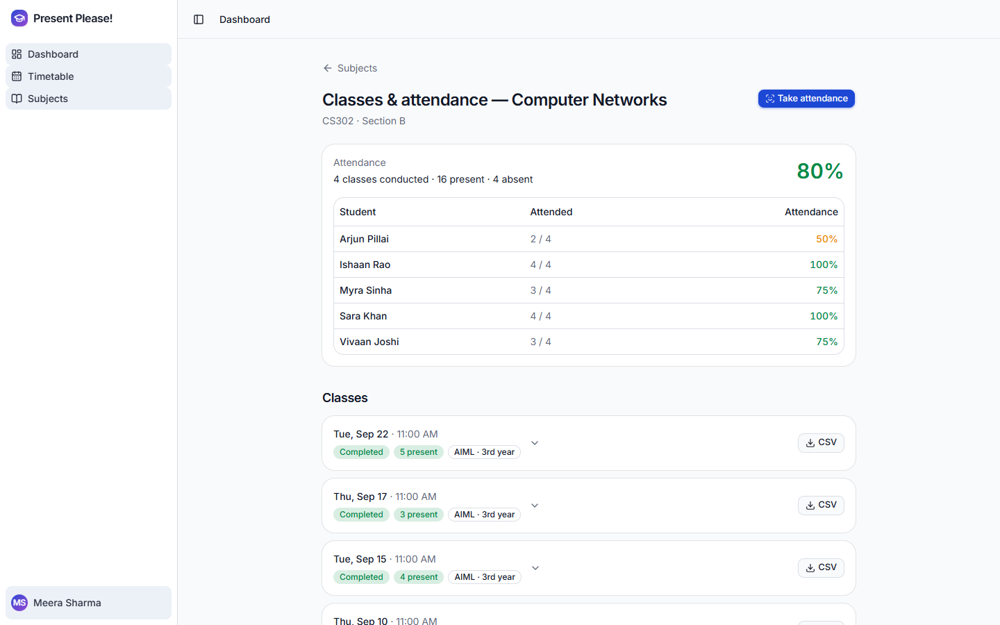 | 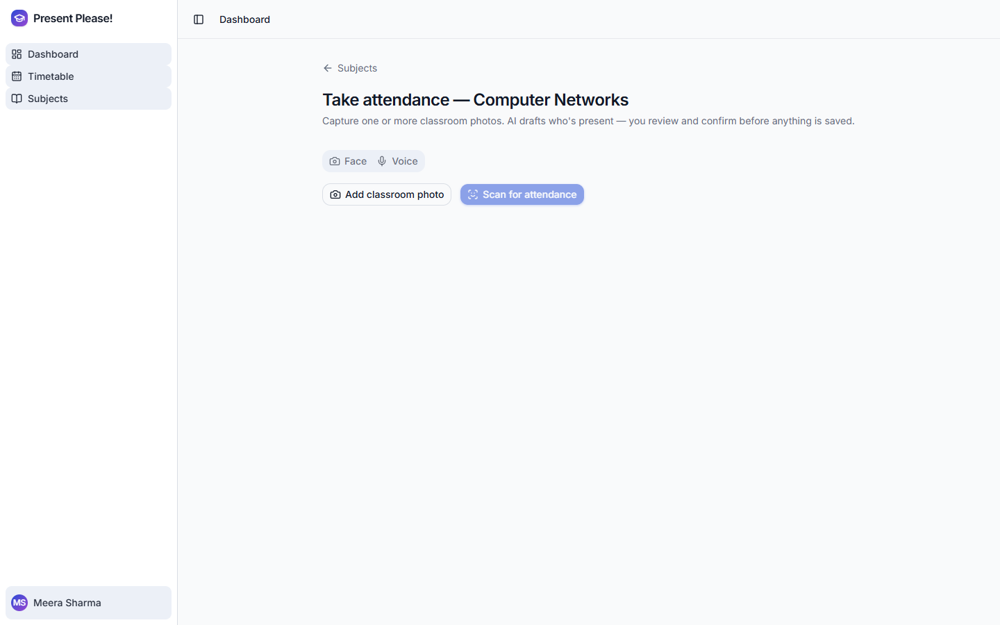 |
| Per subject history: a per student breakdown, every conducted class, and CSV export. | Taking attendance by face or voice for a specific class. |

### Student

| | |
| --- | --- |
|  | 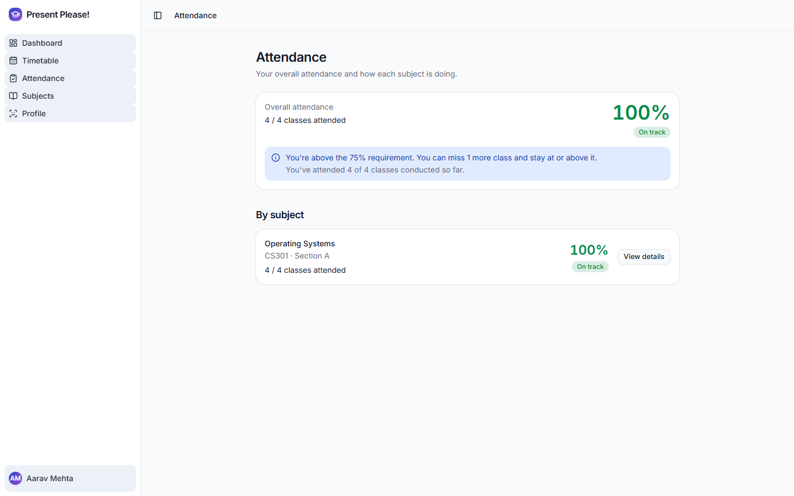 |
| Attendance first: the overall figure, standing against the 75% requirement, then per subject. | Attendance across subjects, with the monthly trend. |
| 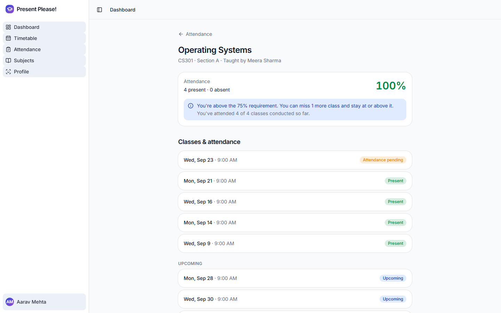 | 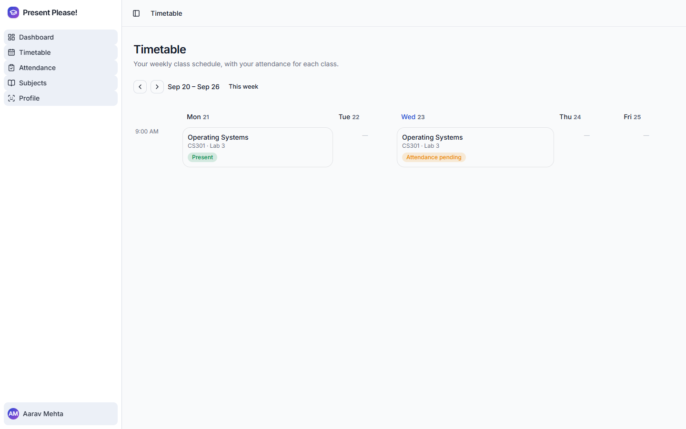 |
| One subject in detail, class by class, showing present, absent or still pending. | A personal weekly timetable carrying the student's own status per class. |
| 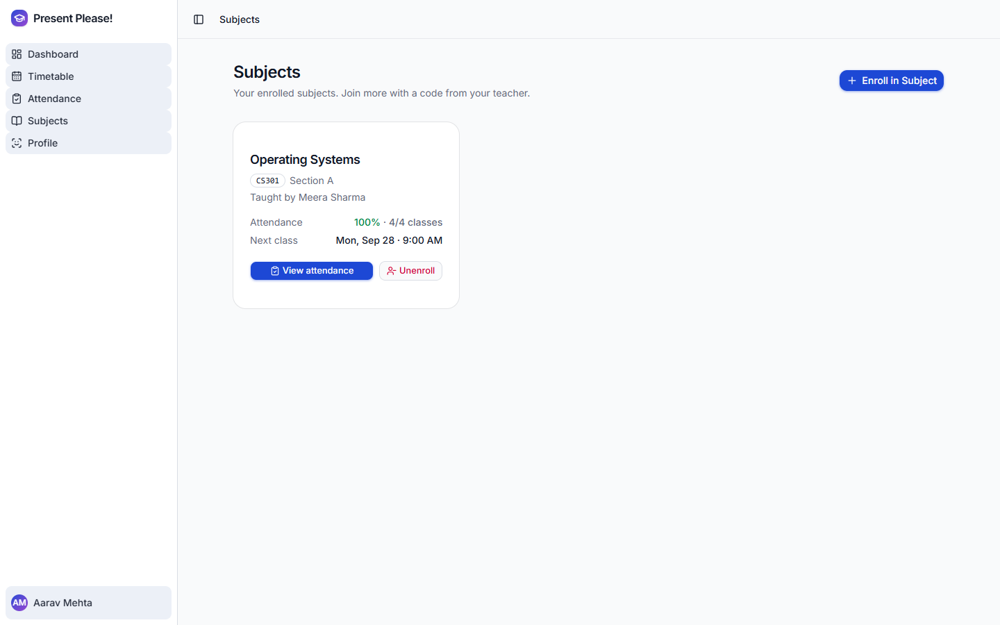 | 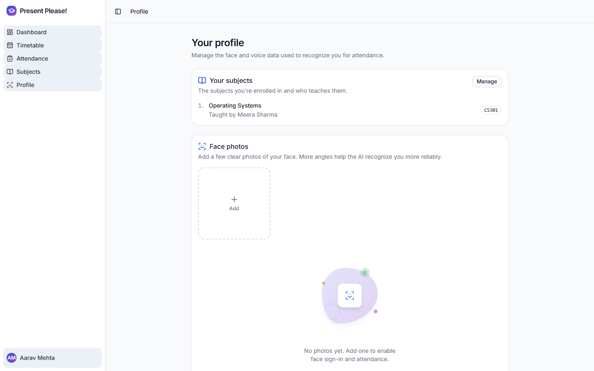 |
| Enrolled subjects, each showing who teaches it and the next class. | Profile: enrolled subjects, plus face and voice enrollment for recognition. |

### Sign in

| | | |
| --- | --- | --- |
| 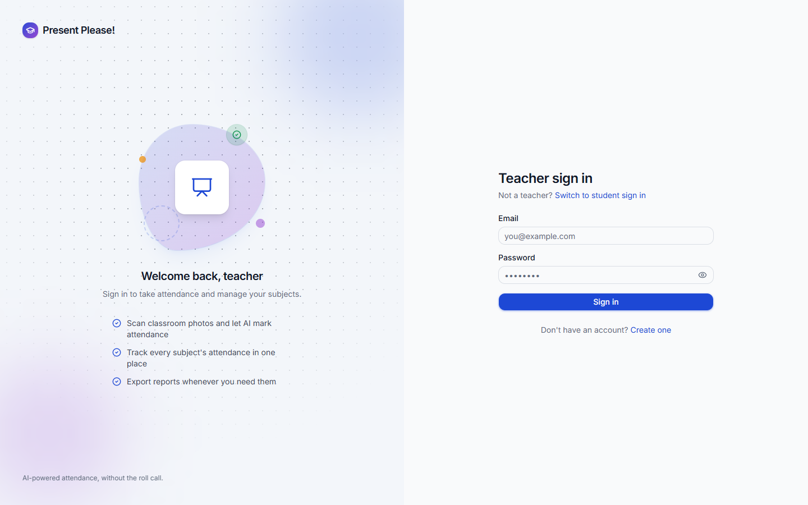 | 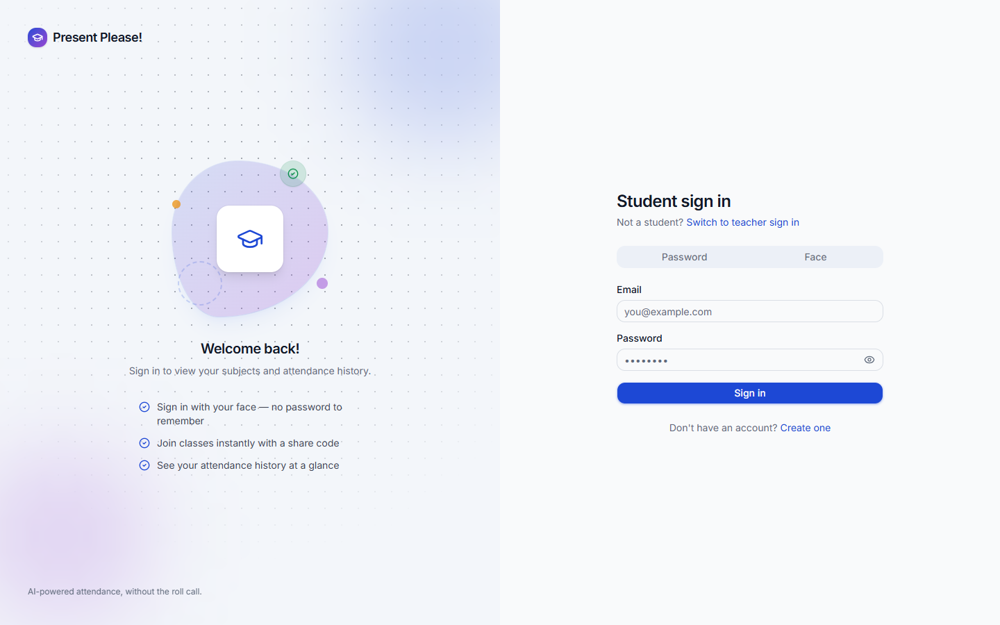 | 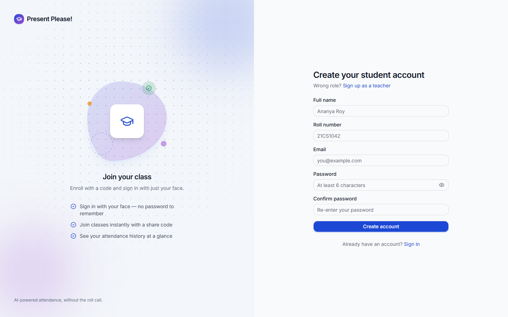 |
| Teacher sign in | Student sign in, including the face option | Account creation with role selection |

## Project overview

Attendance in most institutions is spread across disconnected places: the
timetable lives in one document, the roll call happens on paper or in a
spreadsheet, and the running percentage a student actually cares about is
calculated separately, if at all. Nothing links "this class was supposed to
happen" to "this is who attended it".

Present Please! models that chain explicitly, end to end:

```text
Schedule a class
   -> Conduct the class
   -> Capture attendance by face or voice
   -> AI produces a draft roster
   -> Teacher reviews and edits
   -> Teacher confirms, and only then is it saved
   -> Student sees their updated attendance
   -> Insights against the attendance requirement
```

Because every attendance record traces back to a specific scheduled class,
the system can tell the difference between a class that was cancelled, one
that has not happened yet, one whose attendance is still outstanding, and
one that was actually conducted. That distinction is what makes the
percentages trustworthy.

## Key features

### For teachers

- Create subjects and share them with students using a six character join
  code, a direct link, or a QR code.
- Build a recurring weekly timetable per subject, tagged with branch
  (CSE, ECE, AIML, AIDS, IIOT) and year of study, with room and time.
- Scheduled classes are generated automatically for the next 12 weeks, and
  the weekly slot behind any class can be edited or removed later.
- Cancel an individual class with a reason; cancelled classes stay visible
  and are excluded from attendance calculations.
- Take attendance by face (one or more classroom photos) or by voice (a
  roll call recording), from the moment the class starts until 24 hours
  after it ends.
- Review the AI generated roster before saving: every student can be
  toggled present or absent, with the match confidence and the source
  photo shown alongside.
- See attendance statistics per subject, including a per student breakdown
  and the classes conducted so far.
- Export any attendance session to CSV.

### For students

- Join a subject with a code from the teacher.
- Enroll face photos and a short voice sample used for recognition.
- Sign in with your face instead of a password.
- See a personal weekly timetable with your own attendance status on each
  class.
- Track attendance per subject and overall, with present and absent counts.
- See how your attendance compares to the 75% requirement, how many classes
  you can still miss, or how many you need to attend to get back above it.
- View a month by month attendance trend.

## How attendance works

Attendance capture is deliberately a two stage process. The AI produces a
**draft**, never a saved record. Nothing reaches the database until the
teacher has looked at it and confirmed.

### Face attendance

```text
Classroom photo(s)
   -> Face detection (dlib frontal detector)
   -> 68 point facial landmarks, then a 128 dimensional face descriptor
   -> Linear SVC narrows the candidate among enrolled students
   -> Euclidean distance check (<= 0.6) against that student's stored
      embeddings confirms or rejects the match
   -> Draft roster with per student confidence
   -> Teacher reviews and edits
   -> Teacher confirms, then the session and records are written
```

Multiple photos can be submitted for one scan. When a student is matched in
more than one photo, the highest confidence match is kept, and faces that
match nobody are reported as an unmatched count rather than being silently
discarded.

### Voice attendance

```text
Roll call recording
   -> Split into segments on silence
   -> Each segment converted to a voice embedding (Resemblyzer)
   -> Cosine similarity against enrolled students (>= 0.65)
   -> Best scoring segment per student is kept
   -> Draft roster with per student confidence
   -> Teacher reviews and edits
   -> Teacher confirms, then the session and records are written
```

Audio is converted to WAV in the browser before upload, so the pipeline
does not depend on any system media tooling being installed on the server.

### Why the teacher confirms

Face and voice recognition are probabilistic. A missed match would mark a
present student absent, and a false match would do the reverse, both of
which matter to a student's record. Making the AI output a draft keeps the
teacher accountable for the final roster while still removing the manual
work of calling out thirty names.

## Class and attendance model

The data model separates what is scheduled from what actually happened:

```text
Subject
   -> Timetable slot        (recurring: day of week, time, room, branch, year)
      -> Scheduled class    (one dated occurrence of that slot)
         -> Attendance session   (created only when attendance is taken)
            -> Attendance record (one row per student, present or absent)
```

A scheduled class is not an attendance session. A class exists on the
calendar whether or not anyone marks it, and attendance is recorded only
when a session is actually conducted against it.

Each class carries one of five statuses:

| Status | Meaning |
| --- | --- |
| Upcoming | Scheduled, and has not started yet |
| In progress | Currently happening, between its start and end time |
| Attendance pending | Has ended, but attendance was never taken |
| Completed | An attendance session exists for it |
| Cancelled | Called off; stays visible, counts towards nothing |

Only "cancelled" is stored in the database. The rest are derived at read
time from the clock and from whether a session exists, so a class can never
display a status that contradicts the underlying data.

This matters for correctness: a past class nobody marked shows as
**attendance pending**, never as an absence. Cancelled, upcoming and
unmarked classes produce no attendance records at all, so they are excluded
from every percentage by construction rather than by special casing.

## Attendance insights

Attendance percentage is calculated as present records divided by conducted
records, per subject and overall. On top of that, students see:

- Present and absent counts per subject and in total.
- Their standing against the 75% requirement, colour coded.
- How many further classes they can miss while staying at or above the
  requirement.
- If they are below it, how many consecutive classes they need to attend to
  reach it.
- A month by month trend, so a slipping or improving pattern is visible.

## System architecture

```text
React (Vite)  ─────────────────►  Supabase (Postgres, Auth, Storage, RLS)
     │
     └──── AI operations only ──►  FastAPI  ──service_role──►  Supabase
```

The React application talks **directly to Supabase** for all ordinary data:
authentication, subjects, enrolments, timetables, scheduled classes and
attendance history. Every one of those requests carries the signed in user's
JWT, and Postgres row level security decides what that user may read or
write. Authorisation lives in the database, not in client code.

The FastAPI service is deliberately thin and handles only what Supabase
cannot do from the browser:

- Generating face and voice embeddings during enrollment.
- Running recognition against a subject's enrolled students.
- Matching a face at sign in.
- Resolving a join code to a subject, which a student must be able to do
  before an enrolment exists for row level security to gate on.

Only the backend holds the Supabase `service_role` key, and it is the only
component that can read biometric embeddings.

Face sign in works without sending an email. The backend matches the face,
mints a Supabase magic link token server side, and returns it to the
frontend, which exchanges it for a real session via
`supabase.auth.verifyOtp(...)`. The result is an ordinary Supabase session,
so row level security applies to face authenticated users exactly as it does
to everyone else.

## Privacy and security design

- **Row level security on every table.** Access rules are enforced in
  Postgres, so a modified client cannot read another user's data.
- **Biometric embeddings are unreachable from the browser.** The
  `student_faces` and `student_voices` tables have row level security
  enabled with no policies at all, which denies every client request by
  default. Only the backend's `service_role` key can read them.
- **Face photos are stored in a private bucket**, in a folder keyed to the
  student's own user id, and served only through short lived signed URLs.
- **Students can read only their own attendance records**; teachers can read
  only the subjects they own.
- **Roles are read from the database, not from the token.** A user can
  rewrite their own JWT metadata, so authorisation checks use the role
  stored in the profiles table, which row level security prevents them from
  changing.
- **Uploads are bounded.** Every upload has a size cap, and images are
  rejected by pixel dimensions before being decoded, so an oversized or
  deliberately crafted file cannot exhaust server memory.
- **Secrets stay server side.** The frontend only ever receives Supabase's
  publishable key, which is safe to expose precisely because row level
  security is the real boundary. The `service_role` key exists only in the
  backend environment and is never committed.

## Tech stack

| Layer | Technologies |
| --- | --- |
| Frontend | React 19, TypeScript, Vite, Tailwind CSS, shadcn/ui, React Router |
| Backend | FastAPI, Python 3.10, Pydantic |
| Database | PostgreSQL via Supabase, with row level security |
| Authentication | Supabase Auth, JWT verification via JWKS |
| Storage | Supabase Storage (private bucket, signed URLs) |
| Face recognition | dlib, face_recognition_models, scikit-learn, NumPy, Pillow |
| Voice recognition | Resemblyzer, librosa, PyTorch |
| Deployment | Vercel (frontend), Render (backend) |

## Project structure

```text
present-please/
├── frontend/          React application (pages, components, hooks, lib)
├── backend/           FastAPI service
│   └── app/
│       ├── routers/   API endpoints (face, voice, attendance, subjects)
│       ├── pipelines/ Face and voice recognition
│       └── core/      Config, auth, Supabase client, uploads
├── supabase/          Schema, row level security policies, migrations
├── docs/              Screenshots
└── README.md
```

## Running it locally

**Prerequisites:** Node.js 18+, Python 3.10, and a Supabase project.

1. **Set up the database.** Run the SQL files in `supabase/` in order
   against your Supabase project. See
   [`supabase/README.md`](supabase/README.md) for the order and for the
   storage bucket setup.

2. **Run the backend.** See [`backend/README.md`](backend/README.md) for
   the full setup, including the two dependencies that need special
   handling on Windows. It needs `SUPABASE_URL`, `SUPABASE_SECRET_KEY`
   (the `service_role` key) and `SUPABASE_JWKS_URL` in `backend/.env`.

   ```bash
   uvicorn app.main:app --port 8000
   ```

3. **Run the frontend.** See [`frontend/README.md`](frontend/README.md).
   It needs `VITE_SUPABASE_URL`, `VITE_SUPABASE_PUBLISHABLE_KEY` and
   `VITE_API_URL` in `frontend/.env.local`.

   ```bash
   npm install
   npm run dev
   ```

Both env files are gitignored. Copy the checked in templates
(`backend/.env.example` and `frontend/.env.local.example`) and fill in your
own values.

Note that the backend loads dlib and PyTorch models at startup, so the first
boot takes roughly 20 seconds.

## Deployment

The repository includes configuration for both platforms:
[`backend/render.yaml`](backend/render.yaml) and
[`frontend/vercel.json`](frontend/vercel.json), which adds the SPA rewrite
React Router needs.

Two things to get right:

- On Render, set `FRONTEND_ORIGIN` to the deployed frontend URL exactly,
  with no trailing slash. The CORS middleware allows exactly one origin, so
  a mismatch fails every browser request while working fine from curl.
- In Supabase Auth, set the Site URL to the deployed frontend URL, or
  confirmation emails will point at localhost.

The backend cannot run on a serverless platform: PyTorch and dlib need a
persistent process with enough memory to hold the models.

## Project status

The application is feature complete for a teacher and their students:

- Authentication with role selection, plus face sign in for students.
- Subjects, join codes, and student managed enrolments.
- Recurring timetables with branch and year, generating dated classes 12
  weeks ahead, editable and cancellable.
- Face and voice attendance, both review and confirm before saving.
- Per subject history, per student percentages, attendance insights, and
  CSV export.

Not yet built: cross subject aggregate reporting, and an action to extend a
timetable past the 12 week scheduling horizon.

## Known limitations

These are stated plainly because they are real, and a reader should not have
to discover them by reading the source.

- **Voice matching has been validated with synthetic audio, not with a room
  full of real voices.** Short utterances in particular encode the word more
  strongly than the speaker, so enrollment asks for a fixed passage of about
  15 seconds to compensate.
- **Face sign in has no liveness detection.** A photograph of a photograph
  will pass. A production deployment would need presentation attack
  detection.
- **Anyone can register as a teacher**, since the role is chosen on the
  signup form. This suits a demo; a real deployment would issue teacher
  accounts out of band. Changing your role after signup is blocked.
- **The join code is enforced in the interface, not in the database.** The
  enrolment policy only requires that you enrol yourself, so somebody who
  already knew a subject's internal id could enrol without the code.
- **There is no rate limiting** on the public face sign in endpoint.
- **There are no automated tests.** Behaviour has been verified by hand
  against a live Supabase project.
- Deleting a user cascades their database rows but not their stored photos,
  which is a manual cleanup step.
- The production bundle exceeds Vite's default chunk size warning; no code
  splitting has been introduced yet.

## License

MIT. See [LICENSE](LICENSE).
