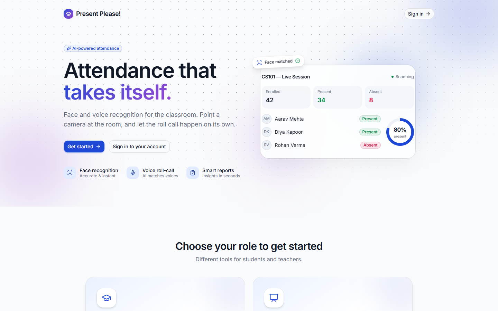
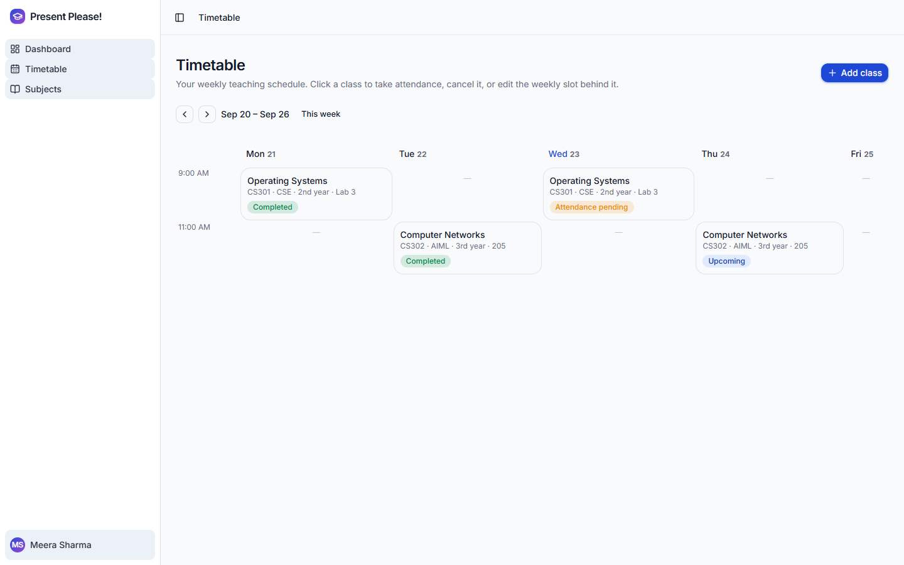
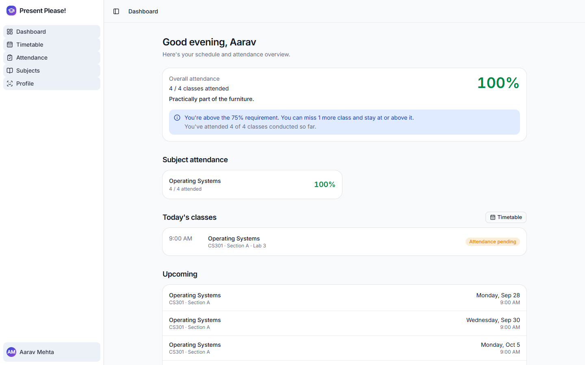

# Present Please!

AI-powered classroom attendance — teachers point a camera or record a
roll-call, AI drafts who's present, the teacher reviews and confirms
before anything is saved. Students enroll their face and voice, join
classes with a code, and can sign in with their face instead of a
password.

A ground-up React + FastAPI + Supabase rewrite of an earlier Streamlit
prototype ("SnapClass") — same recognition pipelines, a proper web stack
around them.

## Screenshots

<!-- The four PNGs below don't exist yet. Capture them (see
     docs/screenshots/README.md for exactly what and at what size), drop
     them in docs/screenshots/, then delete this comment's opening line
     and the closing one to make the table render.

|  |  |
| --- | --- |
|  |  |
| *Landing page* | *A teacher's week — branch, year, room and derived status per class* |
|  |  |
| *AI drafts the roster; the teacher confirms before anything is saved* | *A student's own attendance against the 75% requirement* |

-->

_Screenshots to come._

## What it does

**Teachers** create subjects, share a join code, and take attendance two
ways:

- **Face** — capture one or more classroom photos; a linear-SVC classifier
  narrows the candidate, a Euclidean-distance check against the student's
  stored face embedding confirms the match.
- **Voice** — record a roll-call clip; it's split on silence, and each
  segment is matched against enrolled students by cosine similarity on
  Resemblyzer voice embeddings.

Either way, AI only ever produces a **draft**. The teacher sees an
editable present/absent table — confidence, method, which photo matched
whom — and nothing is written to the database until they confirm. After
that, they can review every past session per subject and export any
session to CSV.

**Students** enroll a few face photos and a short voice clip, join
subjects with a code from their teacher, sign in with their face instead
of a password, and see their own attendance history per subject.

## Architecture

The React app talks **directly to Supabase** for all normal data — auth,
subjects, enrollments, attendance history — under row-level security. It
talks to the **FastAPI backend only for AI work**: enrolling a face/voice
sample, scanning a classroom photo or roll-call recording, and face
login. The backend holds the Supabase `service_role` key and is the only
thing that can read biometric embeddings; those tables have RLS enabled
with zero policies, so every other client is denied by default.

```
React (Vite)  ──────────────►  Supabase (Postgres + Auth + Storage, RLS)
     │
     └──── AI only ──────────►  FastAPI  ──service_role──►  Supabase
```

Face login works without ever emailing a link: the backend matches the
face, then mints a Supabase magic-link token server-side, and the
frontend exchanges it for a real session via
`supabase.auth.verifyOtp(...)`.

## Tech stack

- **Frontend** — React 19, Vite, TypeScript, Tailwind CSS v4, shadcn/ui,
  React Router, react-hook-form + zod.
- **Backend** — FastAPI, PyJWT (verifies Supabase JWTs via JWKS),
  supabase-py.
- **AI** — dlib + face_recognition_models + scikit-learn (face);
  resemblyzer + librosa + torch (voice).
- **Database / Auth / Storage** — Supabase (Postgres, Auth, Storage, RLS).

## Structure

- `frontend/` — the web app. See [`frontend/README.md`](frontend/README.md).
- `backend/` — the AI service. See [`backend/README.md`](backend/README.md).
- `supabase/` — schema + RLS SQL and the order to run it in. See
  [`supabase/README.md`](supabase/README.md).

## Running it locally

1. Create a Supabase project, then run the SQL in `supabase/` in order —
   see [`supabase/README.md`](supabase/README.md).
2. Set up and run the backend — see
   [`backend/README.md`](backend/README.md). It needs `SUPABASE_URL`,
   `SUPABASE_SECRET_KEY` (the `service_role` key), and `SUPABASE_JWKS_URL`
   in `backend/.env`.
3. Set up and run the frontend — see
   [`frontend/README.md`](frontend/README.md). It needs `VITE_SUPABASE_URL`,
   `VITE_SUPABASE_PUBLISHABLE_KEY` (the anon/publishable key), and
   `VITE_API_URL` (the backend's URL) in `frontend/.env.local`.

Both env files are gitignored — copy the checked-in templates
(`backend/.env.example` and `frontend/.env.local.example`) next to each
and fill in your own Supabase project's values.

## Deploying

Backend on **Render**, frontend on **Vercel**. The repo has the config
files each platform needs; the account/dashboard steps below are yours
to do — nothing here creates a service or enters a secret for you.

**Backend (Render)**

1. New → Blueprint, point it at this repo. Render reads
   [`backend/render.yaml`](backend/render.yaml) and proposes a web
   service rooted at `backend/`.
2. Fill in the env vars it prompts for (`SUPABASE_URL`,
   `SUPABASE_SECRET_KEY`, `SUPABASE_JWKS_URL`) — same values as your
   local `backend/.env`. Leave `FRONTEND_ORIGIN` for step 4.
3. Deploy, then note the service's URL
   (`https://present-please-backend.onrender.com`-style).
   `render.yaml` requests the `starter` plan — torch + dlib both need to
   load into memory at startup, which is unlikely to fit the free tier's
   RAM. Check Render's current plan specs and adjust if needed.
4. Once you also have the Vercel URL (below), set `FRONTEND_ORIGIN` on
   the Render service to it, exactly (no trailing slash) — `main.py`'s
   CORS middleware only allows that one origin.

**Frontend (Vercel)**

1. New Project, import this repo, set **Root Directory** to `frontend`.
   Vercel auto-detects Vite; [`frontend/vercel.json`](frontend/vercel.json)
   adds the SPA rewrite React Router needs (without it, refreshing on
   any route other than `/` 404s).
2. Add the three env vars from `frontend/.env.local.example`
   (`VITE_SUPABASE_URL`, `VITE_SUPABASE_PUBLISHABLE_KEY`, and
   `VITE_API_URL` set to the Render URL from above).
3. Deploy, then go back and set the Render `FRONTEND_ORIGIN` to this
   Vercel URL (step 4 above).

**Supabase Auth URL configuration**

Authentication → URL Configuration → set **Site URL** to your Vercel
URL, and add it under **Additional Redirect URLs** too. This only
affects normal signup's email-confirmation link — face login never
follows a redirect (the backend hands the token hash straight back over
the API, and the frontend calls `verifyOtp` with it directly), so it
isn't affected either way, but is worth testing after deploy regardless.

## Build status

Feature-complete for a single teacher and their students:

- **Auth** — email/password signup with a role chosen at signup, plus
  face sign-in for students.
- **Subjects & enrolment** — join codes, a shareable link and QR, and
  students managing their own enrolments.
- **Timetable** — weekly recurring slots per subject, tagged with branch
  (CSE/ECE/AIML/AIDS/IIOT) and year, materialised 12 weeks ahead into
  dated classes a teacher can edit, cancel or remove.
- **Attendance** — face or voice, always as a *draft* the teacher edits
  and confirms. It can be taken from the moment a class starts until 24
  hours after it ends.
- **Reporting** — per-subject history, per-student percentages against a
  75% requirement, and CSV export of any session.

Class status (upcoming / in progress / attendance pending / completed /
cancelled) is derived at read time from the clock and from whether a
session exists, so it can never drift out of sync with reality.

Deploy config for Render and Vercel is committed (see above), but the
app has not actually been deployed yet.

Not yet built: cross-subject aggregate reports, and an "extend schedule"
action for when the 12-week horizon runs out.

## Known limitations

- Voice matching has only been validated with synthetic tones, not real
  human voices in a live classroom.
- Deleting a Supabase auth user cascades their database rows but not
  their objects in the `student-photos` storage bucket — a manual
  cleanup step for now.
- The frontend's production bundle exceeds Vite's default 500KB
  chunk-size warning; no code-splitting has been introduced yet.
- There are no automated tests yet; everything has been verified by hand
  against a live Supabase project.

Known by design, and worth naming rather than leaving to be discovered:

- **Face sign-in has no liveness check.** A photo of a photo will pass.
  Real deployments need presentation-attack detection.
- **Anyone can sign up as a teacher** — the role is chosen on the signup
  form. Fine for a demo; a real deployment would issue teacher accounts
  out of band. (Changing your role afterwards *is* blocked, by RLS.)
- **The join code is enforced in the UI, not in the database.** The
  enrolment policy only requires that you enrol yourself, so someone who
  already knew a subject's UUID could enrol without the code. Closing it
  properly means moving enrolment behind a `security definer` function.
- **No rate limiting** on the public face-login endpoint.
